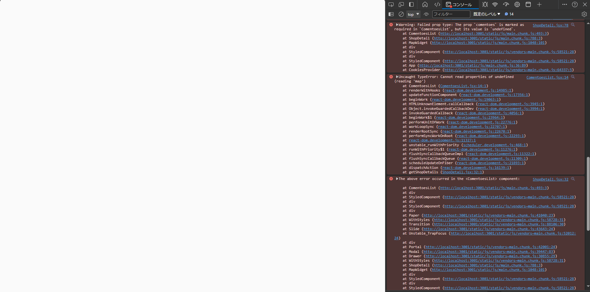

# 課題 1：Front x 不具合修正

## 状況

営業担当者から、「お客様から不具合の連絡が入った」と連絡が入った。\
開発部署内でブラウザ画面の検証ツールでログを確認したところ、下記画像のようなエラーが発生していた。
上司でからの指示で、調査・対応することとなった。

## 課題

- 添付画像の不具合についての調査
- 対応方針を検討し、作業時間の見積もりとともに上司に報告
- 上司の確認後、修正を実施
- 試験項目書を作成し、上司に提出
- 試験項目書のフォーマット等は上司の指定するものを使用する
- 動作確認を実施
- PR を作成

## 実施にあたり

### 作業 branch

例：feature/UVINCI_0001

## 観点

- 不具合の原因を調査できること
- 不具合に対して効果的な修正を実施できること
- 作業時間の見積もり・適時適切な作業報告と調整ができること
- 単体試験について、項目書作成・実施ができること
- git の操法・作業手順について理解していること
