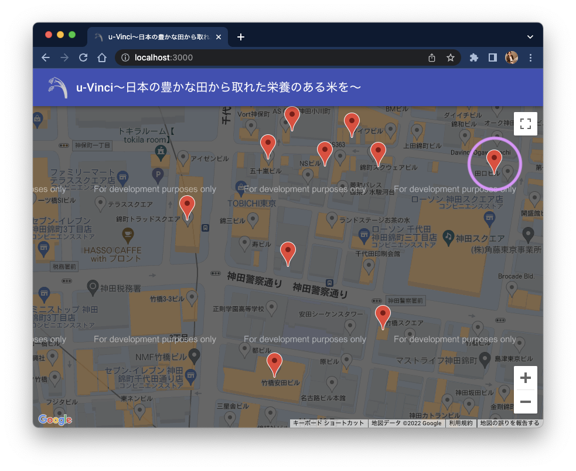
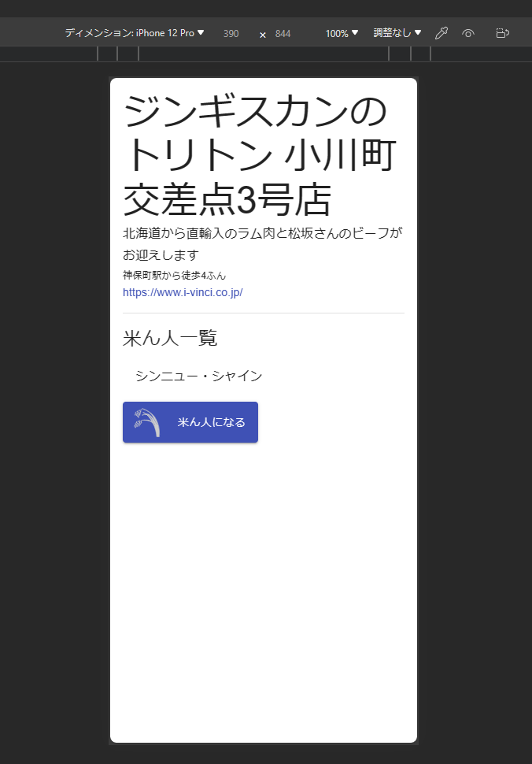

# 課題 2：Front x 改善

## 状況

営業担当者から、「お客様から不具合の連絡が入り、確認したところ次の不具合が確認された」と連絡が入った。

> Iphoneでアプリケーションを使用しているが、店名が長い場合に画面いっぱいに店舗詳細が表示され、マウス操作で地図に戻ることができない。。

上司からの指示で調査・対応することとなった。

## 課題

- 添付画像の不具合について調査
- 対応方針を検討し、作業時間の見積もりとともに上司に報告
- 上司が指定する粒度の設計書を作成
- 上司の確認後、修正を実施
- 試験項目書を作成し、上司に提出
- 試験項目書のフォーマット等は上司の指定するものを使用
- stub での動作確認を実施
- PR を作成

## 実施にあたり

### 作業 branch

例：feature/UVINCI_0002

## 観点

- 課題となっている挙動について把握できること
- 課題に対して適切な対応を提案できること
- 提案した対応策を実現できること
- 作業時間の見積もり・適時適切な作業報告と調整ができること
- 単体試験について、項目書作成・実施ができること
- git の操法・作業手順について理解していること
