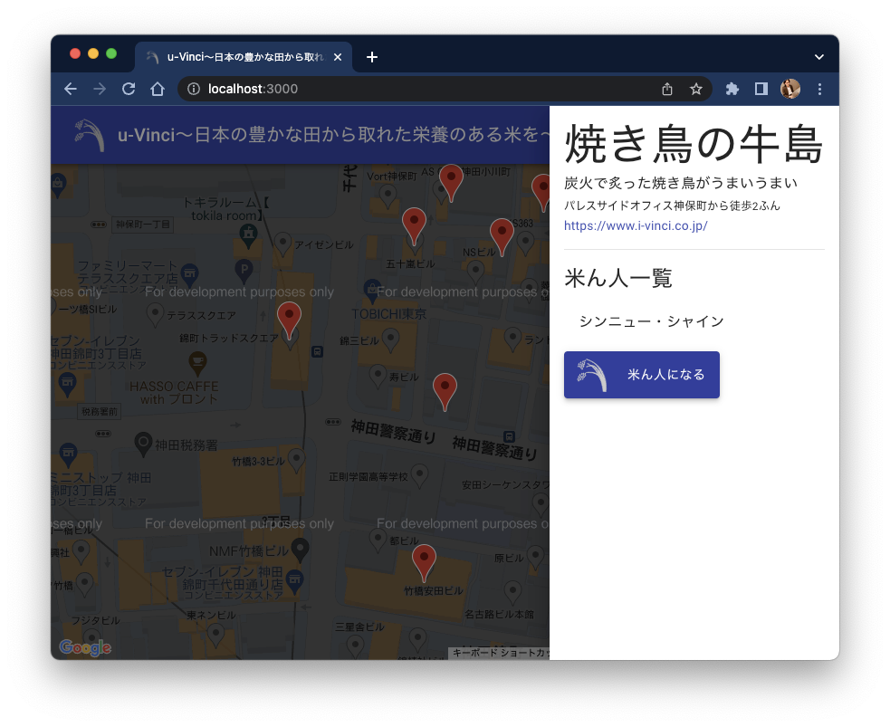

# 課題 3：Front x 機能追加

## 状況

営業担当者から、「複数のお客様から類似したフィードバックが届いた」と連絡が入った。\
上司からの指示で、調査・対応することとなった。

## お客様の声

> 「米ん人になる」ボタンを押したあと、2 回 3 回と押せるのに、画面には何も変化が起こらないのが気になります。

> え、米ん人って、解除することはできない？

> 米ん人になったあと、解除できないのはサービスとして理解できるのですが、解除できないならできないでボタンを押せなくしてほしい。ほんと違和感。。。

## 課題

- 上司を通して営業担当者と協議し、対応方針を決定
- 必要作業・所要時間を見積もり、上司に報告
- 上司が指定する粒度の設計書を作成
- 上司の確認後、修正を実施
- 試験項目書を作成し、上司に提出
- 試験項目書のフォーマット等は上司の指定するものを使用
- 動作確認を実施
- PR を作成

## 実施にあたり

### API

API は他サービスとも共通して使用されているため、フロント側の改修のみで「米ん人解除」が可能と判明している。\
詳細は下記の資料に記載されている。
[detail-design.md](../uVinci/api/detail-design.md)

### 作業 branch

例：feature/UVINCI_0003

## 観点

- 課題となっている挙動について把握できること
- 必要とされる機能を把握し提案できること
- 提案した対応策を実現できること
- 作業時間の見積もり・適時適切な作業報告と調整ができること
- 単体試験について、項目書作成・実施ができること
- git の操法・作業手順について理解していること
